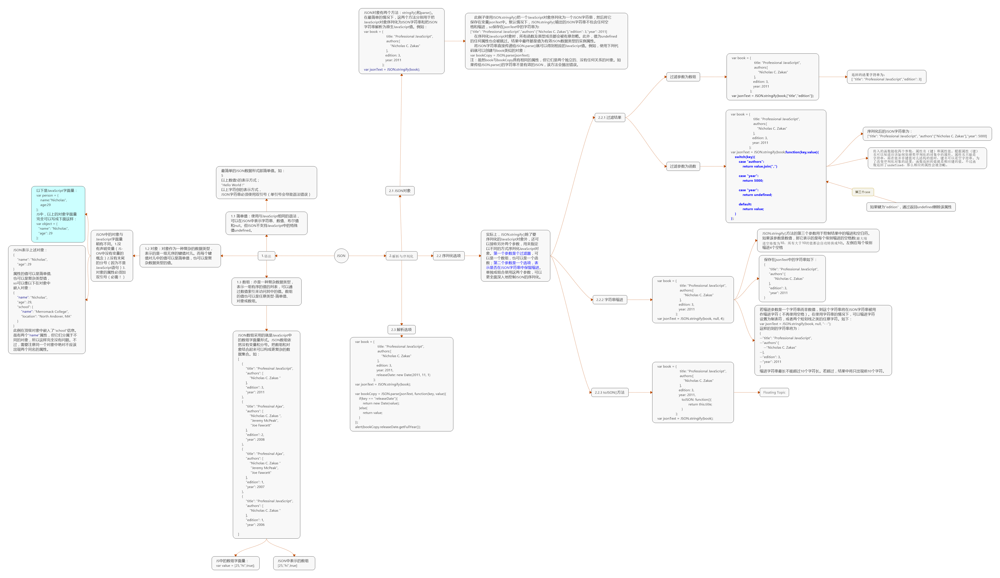

### JSON  
Json(JavaScript Object Notation,JavaScript对象表示法)，是JavaScript的一个严格的子集，利用JavaScript中的一些模式来表示结构化的数据。Douglas Crockford 认为与XML相比，JSON是在JavaScript中读写结构化数据的更好的方式。因为可以把JSON直接传给eval()，而且不必创建DOM对象。最重要的一点事要理解JSON是一种数据格式，不是一种编程语言。虽然具有相同的语法形式，但是JSON并不从属于JavaScript，且不是只有JS才能使用JSON，毕竟JSON只是一种数据格式。很多编程语言都有针对JSON的解析器和序列化器。  
